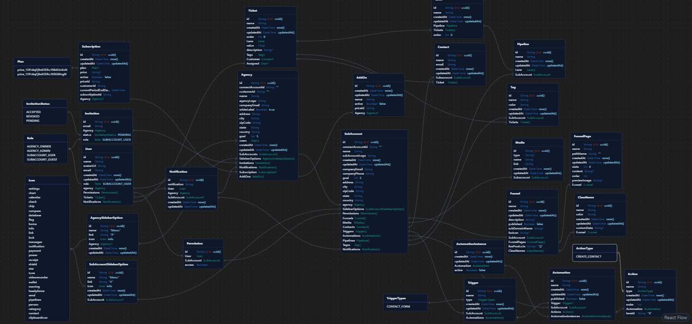

## Plura - A SaaS Website Drag & Drop Builder for Agencies

### Builder | Dashboard | Agencies | sub Agencies

<!--  -->

First, do the following:

```js
- fill .env file
```

then , run the development server:

```bash
npm install
npm run dev
```

Open [http://localhost:3000](http://localhost:3000) with your browser to see the result.

#### Project Snippets

- Landing page
  

-

#### 3rd-Party Services & Libraries Used

- Next 14.2
- Shadcn
- [Cloud Postgres DB](https://neon.tech/)
- [Clerk Authentication](https://clerk.com/)
- UploadThings (for file/media storage)
- Prisma / PostgreSQL (Neon)

#### Project Features

- root/landing page of the app is in _src.app.site.page.tsx_. (the logic to mask _site_ route to the root of the project is created in middleware)

#### Project Strategies

**How Subdomains are working**

> The subdomain logic works such that it checks for the url entered in the url bar and then manipulate it such that the subdomain is a page in the application, which keeping the url bar inchanged. Ex

> Input: http://noor.localhost:3000/surveys

> Rewrite to: http://localhost:3000/noor./surveys (where noor is domain and survey is the path)

> Check: Middleware, folder structure -> _app.domain.path.page.tsx_

**Database Logic and Strategy**

> Check the schema.prisma file. Also check the Entity-Relationship Diagram in reference images. (Trigger, Automation & AutomationInstance are not in use. Role 'SUBACCOUNT_GUEST' is also not is use for this project, they have just their schema created)

> Pipeline is entire Kanban board, Each pipeline can have Lane, Each Lane can have tickets, Each ticket we can assign tags

> Agency can have multiple users, and subAccounts

> Contact are the leads that come to the subaccounts through the website (Funnel), each Funnel has a FunnelPage (pages of a website)

> Each uploaded file is a Media, which belongs to a subaccount

> ClassName & Addon is (\_\_\_\_)

> Subscription is for the Stripe. We will use it to keep the subscription details of an agency. (which plan they have)

#### Known issues of the project

-

#### Reference Images


